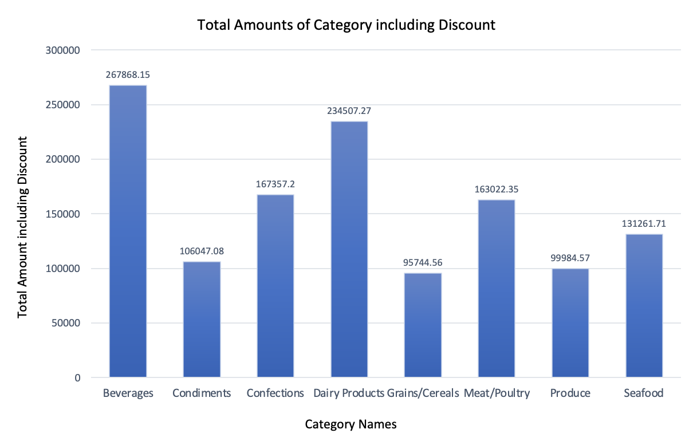
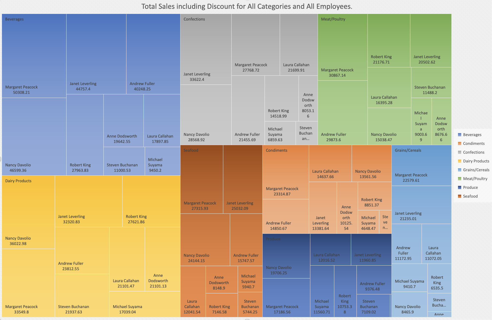
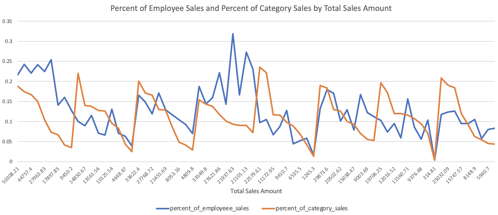

# A Data Analysis Approach with SQL: Data-Driven Insights for Northwind Traders Company Operations

## **Project Overview**

The company, Northwind Traders, specializes in food imports and exports
across the globe. All trading data is stored in the Postgres database
called "Northwind." This project aims to help various departments like
Logistics, HR, Pricing, and Sales gain valuable insights from the
company’s operational data through SQL queries. These insights are used
to assess performance and guide decision-making for the upcoming year.

### **Business Problem**

This project focuses on analysing the performance of Northwind Traders,
a company that deals with the import and export of specialized foods
globally. The project utilizes a PostgreSQL database to store and
analyse the company’s trading and transactional data, which consists of
15 datasets from various departments, including Product, Logistics,
Human Resources, Pricing, and Sales. The project aims to extract
insights to inform strategic decisions across departments by querying
the data using SQL.

### **Business Inquiries**

Key departments raised specific business inquiries:

-   **Product Team**: Assess product pricing strategy based on products
    priced between $10 and $50.

-   **Logistics Team**: Retrospective analysis of shipping performance
    for the years 1996–1997.

-   **HR Team**: Determine the age of employees when they joined the
    company and their current managers.

-   **Pricing Team**: Identify product price changes and compare
    products against the category’s average and median prices.

-   **Sales Team**: Build KPIs to measure employee performance based on
    sales amount, discounts, and total orders

## **Data Understanding**

The organisation stores and maintains all its trading and transactional
data in the Postgres database named “Northwind” consisting of 15
datasets for various respective divisions’ details. The below table
gives high-level information about the database and its tables.

<table>
<colgroup>
<col style="width: 6%" />
<col style="width: 21%" />
<col style="width: 8%" />
<col style="width: 62%" />
</colgroup>
<thead>
<tr>
<th colspan="2" style="text-align: right;">Database Name:</th>
<th colspan="2">Northwind</th>
</tr>
</thead>
<tbody>
<tr>
<td colspan="4"> </td>
</tr>
<tr>
<td style="text-align: right;">Sr.No.</td>
<td>Table Names</td>
<td>Count of Records</td>
<td>Description</td>
</tr>
<tr>
<td style="text-align: right;">1.</td>
<td>categories</td>
<td>8</td>
<td>Master table of food categories.</td>
</tr>
<tr>
<td style="text-align: right;">2.</td>
<td>products</td>
<td>77</td>
<td>Master table containing products details.</td>
</tr>
<tr>
<td style="text-align: right;">3.</td>
<td>suppliers</td>
<td>29</td>
<td>Master table of food suppliers.</td>
</tr>
<tr>
<td style="text-align: right;">4.</td>
<td>order_details</td>
<td>2155</td>
<td>Secondary table of food orders information on orders placed by
customers.</td>
</tr>
<tr>
<td style="text-align: right;">5.</td>
<td>orders</td>
<td>830</td>
<td>Master table tracking all orders placed by customers.</td>
</tr>
<tr>
<td style="text-align: right;">6.</td>
<td>employees</td>
<td>9</td>
<td>Master tables of the company’s employee details.</td>
</tr>
<tr>
<td style="text-align: right;">7.</td>
<td>employeeterritories</td>
<td>49</td>
<td>Secondary table of employees &amp; territories.</td>
</tr>
<tr>
<td style="text-align: right;">8.</td>
<td>territories</td>
<td>53</td>
<td>Master table of employee's territories.</td>
</tr>
<tr>
<td style="text-align: right;">9.</td>
<td>region</td>
<td>4</td>
<td>Master table of regional employee allocation and related data.</td>
</tr>
<tr>
<td style="text-align: right;">10.</td>
<td>customers</td>
<td>91</td>
<td>Master table of customers information for all orders.</td>
</tr>
<tr>
<td style="text-align: right;">11.</td>
<td>customercustomerdemo</td>
<td>0</td>
<td> -</td>
</tr>
<tr>
<td style="text-align: right;">12.</td>
<td>customerdemographics</td>
<td>0</td>
<td> -</td>
</tr>
<tr>
<td style="text-align: right;">13.</td>
<td>shippers</td>
<td>6</td>
<td>Master table of order shippers.</td>
</tr>
<tr>
<td style="text-align: right;">14.</td>
<td>shippers_tmp</td>
<td>6</td>
<td> -</td>
</tr>
<tr>
<td style="text-align: right;">15.</td>
<td>usstates</td>
<td>51</td>
<td> -</td>
</tr>
<tr>
<td colspan="4"> </td>
</tr>
<tr>
<td colspan="2" style="text-align: right;">Total Datasets:</td>
<td colspan="2">15</td>
</tr>
<tr>
<td colspan="4"> </td>
</tr>
</tbody>
</table>

Table A: Database and its tables details.

The master tables include all the distinct records of a specific entity
whereas secondary tables hold all the records of the entity’s doings.
For instance, an order table consists of unique order information set by
customers. Similarly, order\_details contains all information and
features of each and every particular order which specifies (order -&gt;
order\_details) one to many relation between order and order\_details
table.

An Entity Relationship Diagram (ERD) below visually represents the
relationships between these datasets, providing a comprehensive view of
the database schema. It displays the relational integrity, relationship
between entities, and different attributes of the datasets. And these
 symbols indicate one
-&gt; many relation between the tables.

Figure A: Entity Relationship Diagram (ERD) for the dataset.

Various departments of the company essentially Product, Logistics, Human
Resource, Pricing, and Sales needed to analyse the performance of their
business relations and thus to facilitate this objective, data from the
below highlighted datasets provided important knowledge which would
assist them to take further strategic actions and decisions.

Table B: Highlighting datasets that help acknowledge business purposes.

## **Technologies Used**

-   **PostgreSQL**: Database management system for storing and querying data.

-   **DBeaver**: Database management tool used for running SQL queries and managing the database.
  

## **Database Setup: Instructions to Create and Connect to the Postgres Database.**

Below are the steps to position the open-source Postgres database
environment.

1.  Download and install the Postgres database as per the desired OS environment.
    For instance, PostgreSQL version 11.17

2.  Then download and install any integrated development environment (IDE) tool that would facilitate communication with the Postgres database.
    For instance, download and install the DBeaver database tool which will act as a database manager and SQL client to interact with the Postgres database.

Below are the steps to Create and Connect to the Database (Northwind) in the Postgres environment.

1.  For the creation of the database, we need to execute a command in
    the DBeaver script console:

    Syntax: createdb &lt;database name&gt;;
    For Example: createdb Northwind;

    Note: If the database is successfully created then there will be no response/error message else a relevant message will be prompted, and we need to debug and fix it.

2.  Then create the schema/user under which all the tables/datasets will reside/be created. If the schema is not created, tables will be part of the default schema named "public".

3.  Create a table. Following is the syntax.
    Syntax:
       CREATE TABLE &lt;table name&gt; (
        &lt;"1st attribute name"&gt; &lt;data type&gt;,
        &lt;"2nd attribute name"&gt; &lt;data type&gt;,
        &lt;"3rd attribute name"&gt; &lt;data type&gt;
    );
    For Example:
    > Creating table: categories with the attributes: category\_id (with
    > datatype: smallint), category\_name (character), description (text)
    > and picture (bytea)
    >
    > CREATE TABLE categories (
    >
    > "category\_id" smallint NOT NULL, &lt;- NOT NULL ensure value is left NULL
    > "category\_name" character varying(15) NOT NULL,
    > "description" text,
    > "picture" bytea
    > );

4.  Insert data/records in the tables. Following is the syntax.
    Syntax:
    > INSERT INTO &lt;table name&gt; VALUES (&lt;value for 1st
    > attribute&gt;, &lt;value for 2nd attribute&gt;, &lt;value for 3rd
    > attribute&gt;);
    For Example:
    Inserting records in the table.
    > INSERT INTO categories VALUES (1, 'Beverages', 'Soft drinks, coffees,
    > teas, beers, and ales', '\x');
    >
    > INSERT INTO categories VALUES (2, 'Condiments', 'Sweet and savory
    > sauces, relishes, spreads, and seasonings', '\x');

5.  In the DBeaver tool which operates like both the Postgres database manager and SQL client to connect with the database, it will look like the below after the successful formation of all tables and records.

Figure B: After the creation of all the tables and their attributed view
in the DBeaver database tool.

6.  In addition, connecting and accessing the data from the Postgres database through programming languages like Python requires the use of the psycopg2 package which assists in establishing a connection and interacting with the Postgres database. Following are the steps.

    a.  Import psycopg2 package.
                > import psycopg2

    b.  Create connection variables.
                > host: &lt;Hostname on which Northwind Postgres database resides&gt;
                > port: &lt;Post number of the database listens to requests&gt;
                > user: &lt;User name to connect to the database&gt;
                > password: &lt;"Password for the user to connect to the database"&gt;
        For instance:
                > host: localhost
                > port: 5432
                > user: admin
                > password: "\*\*\*\*\*\*\*\*\*\*\*\*\*"

   c.  Create a connection with the help of the above connection variables and the package.
                > connection = psycopg2.connect(
                > user=user,
                > password=password,
                > host=host,
                > port=port,
                > database=Northwind
                > )

d.  Check and verify the established connection.
                > connection.get\_dsn\_parameters()
                > connection.status
                Note: Output 1 signifies a successful connection.

## **Answers to Business Inquiries.**

**1\] For their annual review of the company pricing strategy, the Product Team wants to look at the products that are currently being offered for a specific price range ($10 to $50).**

Figure 1: Number of products in the various specific price range between
$10 and $50.

Figure 2: Product names with a price range between $10 and $50.

The above figure 1, illustrates the number of products in the 4
different price groups ranging from $10 to $50 which the Product team
wants to consider for the annual review of the company pricing strategy.
Below are some related highlights.

-   Total: 52 food products that are currently available/not
    discontinued in this requested price range.

-   The majority of the products 26 (i.e. 50% of the total) are within
    the price group \[10 – 20\], followed by 12 and 10 products from the
    price group \[20 – 30\] and \[30 – 40\] respectively.

-   The name of 4 products from the price group \[40 – 50\] are: Tarte
    au sucre, Ipoh Coffee, Schoggi Schokolade and Vegie-spread.

-   There are only 3 products for $10 namely: Aniseed Syrup, Longlife
    Tofu and Sir Rodney's Scones.

-   Overall half of the available food products (26) are above $20 and
    the rest (26) are below $20 signifying it’s a 50:50 ratio.

**2\] The** **Pricing Team wants to know how each category performs
according to their below price range.**

**1. Below $10**

**2. $10 - $20**

**3. $20 - $50**

**4. Over $50**

Figure 11: Category-wise total number of orders.

The above figure 11 shows the total orders for all the categories of
food products.

-   The highest performance amount of orders totalling 404 was confirmed
    for the beverages category, followed by 366 for dairy products, 330
    for seafood, and 334 for confections.

-   The smallest volume of orders 136 was placed for the produce
    category of food items.

-   For the rest category of the products namely meat/poultry,
    grains/cereals and condiments the total orders ranged from 135 to
    220 which informed average performance in contrast to others.

Figure 12: Total price of the category of products in a specific price
range.

Figure 13: Total amount of categories including discount.

Figures 12 and 13 present the total price of the categories in the
specified price range and the total amount of sales of categories
including the discount offered for which the Pricing team need to
conduct their assessment.

-   The two price ranges in ranking - first, $20 - $50 in the beverages
    category and second, over $50 in dairy products achieved the highest
    results as compared to other price ranges and categories.

-   The lowest was noted for meat/poultry for $20 - $50 price range with
    zero, kept on with a slight increase for dairy products in Below $10
    and produce in $10 -$20 range.

-   Similarly, beverages and dairy products top the list of the total
    amount of sales including discounts given.

-   Confections, meat/poultry and seafood categories showed a marginally
    higher volume of sales compared to the remaining categories’
    condiments, grains/cereals and produce.

**3\] The Logistics Team wants to know what is the current state of our
regional suppliers' stocks for each category of product. And their
supplier region” as:**

**1. “America”**

**2. “Europe”**

**3. “Asia”**

**4. “Oceania”**

Figure 14: Total units of products in stock, on order and reorder level
for each supplier region.

The above figure 14 displays the total units of products for 3 groups i)
stock, ii) on order and reorder level for supplier regions requested by
the Logistics team.

-   Across all the regions total units of the products in stock are
    higher than on-order and reorder levels.

-   For the Europe region, almost the same units of products were
    recorded on order and reorder level. Whereas for the rest 3 regions,
    America, Asia and Oceania, remarkably higher units were reordered
    compared to on-order product units.

-   In all, the highest units of products were maintained in stock and
    for on-order and reorder levels in the Europe region which informs
    its better state than other regions.

Figure 15: Total of units of products category in stock, on-order, and
reorder level for the supplier region.

Figure 15 emphasises the total units of categories of products for 3
groups i) stock, ii) on order and reorder level for specific supplier
regions given by the Logistics team in order to determine their state.

-   Oceania had minimal units of categories of products recording less
    than 50 total units for all groups – in stock, on-order and reorder
    level as compared to other regions.

-   Europe listed the greatest units of products for all the groups
    except for a few categories namely meat/poultry with no units and
    few units for produce just in stock.

-   For the condiments category of products, America reported noticeably
    better performance than Europe. And the produce category recorded
    the lowest for all regions.

-   In all, Europe and America stated a stronger position than Asia and
    Oceania.

**4\] The Pricing Team wants to know for each currently offered product
how their unit price compares against their categories average and
median unit price. And their position against the category average and
median unit price as:**

**1. “Below Average”**

**2. “Average”**

**3. “Over Average”**

Figure 16: Total average price.

Figure 17: Categories and their sum of unit price.

Figure 18: Category names and their average unit price.

The above figures display categories of products and it’s the total
average price and other aggregation details of all the currently
available product categories for the Pricing team to access.

-   Of the currently available products, 34% of product categories are
    over average and 66% below average.

-   The total unit price of the beverages category shows the highest
    amount as compared to others. Whereas, meat/poultry is at the lowest
    level.

-   Also, similar, beverages and meat/poultry are at an extreme level on
    the scale of average unit price.

-   The produce and dairy products category shows the almost same
    average price and the remaining category’s average price is below
    25.

**5\] The Sales Team wants to build a list of KPIs to measure employees'
performances.**

Figure 19: Employee’s performance.

Figure 20: Employee’s performance details.

The above figure illustrates the employee’s performance that the Sales
team want to access. It features various performance indicators.

-   Irrespective of the discount, employee Margaret Peacock tops the
    rank and has outstanding performance with over 230 thousand in total
    sales amount. The next in rank are Janet Leverling in 2nd
    position and Nancy Davolio in 3rd with both over 200
    thousand in total sales amount.

-   The least performers are Steven Buchanan, Michael Suyama and Anne
    Dodsworth, all with total sales amount in between 68 and 77
    thousand.

-   The performance indicator with respect to i) the total number of
    unique orders, ii) the total number of orders and iii) the average
    product amount directly corresponds to the total sales amount
    including/excluding discount indicator throughout the employees.

-   For the total discount amount, two employees Margaret Peacock and
    Robert King outperform others by offering over 16 thousand total
    discounts.

<table>
<colgroup>
<col style="width: 24%" />
<col style="width: 18%" />
<col style="width: 16%" />
<col style="width: 22%" />
<col style="width: 17%" />
</colgroup>
<thead>
<tr>
<th>Employee Full Name</th>
<th style="text-align: right;">Number Unique Orders</th>
<th style="text-align: right;">Total Discount Amount</th>
<th style="text-align: right;">Total Sales Amount Including
Discount</th>
<th style="text-align: right;">Total Discount Percent</th>
</tr>
</thead>
<tbody>
<tr>
<td>Margaret Peacock</td>
<td style="text-align: right;">156</td>
<td style="text-align: right;">17296.61</td>
<td style="text-align: right;">232890.84</td>
<td style="text-align: right;">6.91</td>
</tr>
<tr>
<td>Janet Leverling</td>
<td style="text-align: right;">127</td>
<td style="text-align: right;">10238.45</td>
<td style="text-align: right;">202812.84</td>
<td style="text-align: right;">4.8</td>
</tr>
<tr>
<td>Nancy Davolio</td>
<td style="text-align: right;">123</td>
<td style="text-align: right;">10036.11</td>
<td style="text-align: right;">192107.6</td>
<td style="text-align: right;">4.96</td>
</tr>
<tr>
<td>Andrew Fuller</td>
<td style="text-align: right;">96</td>
<td style="text-align: right;">11211.51</td>
<td style="text-align: right;">166537.75</td>
<td style="text-align: right;">6.3</td>
</tr>
<tr>
<td>Laura Callahan</td>
<td style="text-align: right;">104</td>
<td style="text-align: right;">6438.76</td>
<td style="text-align: right;">126862.27</td>
<td style="text-align: right;">4.83</td>
</tr>
<tr>
<td>Robert King</td>
<td style="text-align: right;">72</td>
<td style="text-align: right;">16727.76</td>
<td style="text-align: right;">124568.23</td>
<td style="text-align: right;">11.83</td>
</tr>
<tr>
<td>Anne Dodsworth</td>
<td style="text-align: right;">43</td>
<td style="text-align: right;">5655.93</td>
<td style="text-align: right;">77308.06</td>
<td style="text-align: right;">6.81</td>
</tr>
<tr>
<td>Michael Suyama</td>
<td style="text-align: right;">67</td>
<td style="text-align: right;">4284.97</td>
<td style="text-align: right;">73913.12</td>
<td style="text-align: right;">5.47</td>
</tr>
<tr>
<td>Steven Buchanan</td>
<td style="text-align: right;">42</td>
<td style="text-align: right;">6775.47</td>
<td style="text-align: right;">68792.28</td>
<td style="text-align: right;">8.96</td>
</tr>
</tbody>
</table>

Figure 21: Additional employee performance details.

The above figure provides information about employee performance so the
Sales team can evaluate workers on additional attributes.

-   In terms of the number of distinct orders handled, the top 3
    employees are Margaret Peacock (156), Janet Leverling (127) and
    Nancy Davolio (123).

-   Robert King addressed 72 distinct orders, on the other hand, he
    rendered the highest total discount of 11.83%.

-   Though Andrew Fuller and Laura Callahan noted fewer orders compared
    to the top 3 performers in distinct orders, their total sales are
    noticeably higher over 120 thousand.

**6\] The Sales Team wants to build another list of KPIs to measure
employees' performances across each category.**

Figure 22: Total sales including a discount for all categories and all
employees.

Figure 23: Percent of employee sales and present of category sales by
total sales amount.

Figure 24: Sum of the percent of category sales across categories.

Figure 25: Sum of the percent of employees’ sales across categories.

The above figures illustrate total sales including a discount for all
categories and all employees, the percent of employee sales and category
sales by total sales amount and the sum of the percent of the category,
and employee sales across categories as the Sales team needed to prepare
a list of employee performance across categories.

-   Margaret Peacock ranks at the top of the total sales amount
    considering discounts in the majority of categories including
    beverages, condiments, grains/cereals, meat/poultry and seafood
    (i.e. 5 out of 8 categories).

-   For beverages in 2nd position it’s Nancy Davolio and in
    3rd place Andrew Fuller. Similarly, for condiments, it’s
    Andrew Fuller and Laura Callahan.

-   Nancy Davolio, Margaret Peacock and Laura Callahan are the top 3
    performers for the category confections.

-   In the grains/cereals category, Janet Leverling is in 2nd
    position and Andrew Fuller is in 3rd.

-   For dairy products, the top 3 rankers are Nancy Davolio, Janet
    Leverling and Robert King.

-   Robert King is in 2nd place and Janet Leverling at
    3rd in the meat/poultry category.

-   The produce category has Nancy Davolio, Margaret Peacock and Laura
    Callahan as the top total sales workers.

-   For seafood, Janet Leverling is in 2nd position and Nancy
    Davolio is in 3rd.

-   The sum of the percent of category sales is relatively even across
    the categories. However, the sum of the percent of employee sales
    across categories shows relevant fluctuations.

<small>Project based on the <a target="_blank" href="https://drivendata.github.io/cookiecutter-data-science/">cookiecutter data science project template</a>. #cookiecutterdatascience</small>

The repository is organized as follows:

Project Organization
------------

    ├── LICENSE
    ├── Makefile        <- Makefile with commands like `make data` or `make train`
    ├── README.md       <- The top-level README for everyone using this project.
    ├── sql
    │   ├── *.sql       <- SQL queries (DML) for all the business inquiries.
    │   ├── *.csv       <- SQL results fetched to csv files.
    │   └── Northwind_PostgreSQL.sql  <- Database, schema creation and data insertion SQL queires.
    │                                        
    │
    ├── reports            <- Final Project Report.pdf
    │          
    │
    ├── attachments        <- Images and diagrams form README.md
    │
    └── requirements.txt   <- The requirements file for reproducing the analysis environment, 
                              e.g. generated with `pip freeze > requirements.txt`
